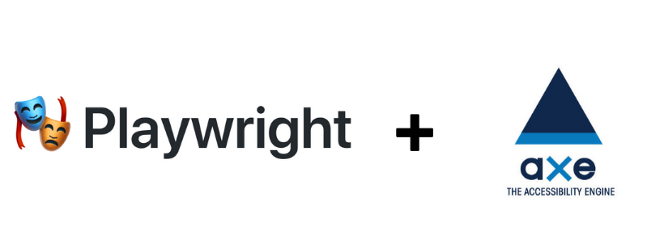
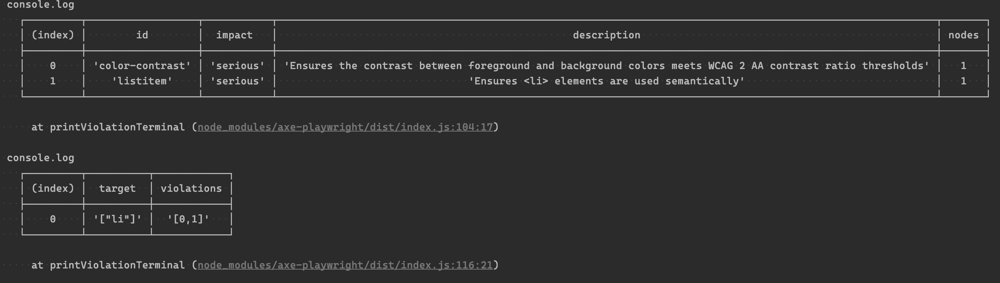
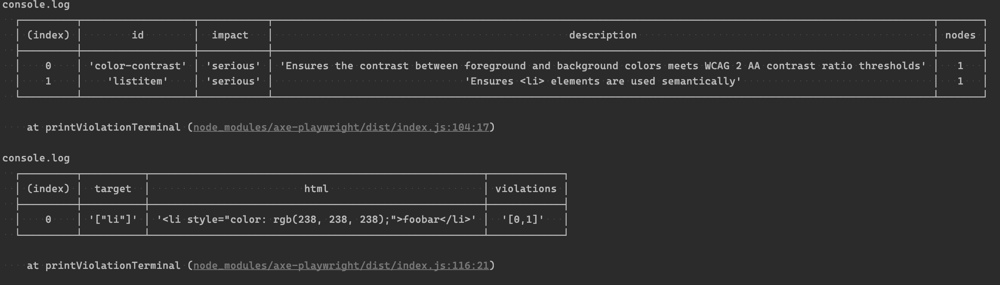

# Axe-Playwright

[](https://app.circleci.com/pipelines/github/abhinaba-ghosh/axe-playwright)
[](https://www.npmjs.com/package/axe-playwright)
[](https://www.npmjs.com/package/axe-playwright)

[Axe](https://www.deque.com/axe/) is an accessibility testing engine for websites and other HTML-based user interfaces. This package provides simple axe analyser commands which you can incorporate in your [Playwright](https://www.npmjs.com/package/playwright) tests.

## Install and configure

### Add as a dev dependency:

```sh
npm i -D axe-playwright
```

### Install peer dependencies:

```sh
npm i -D playwright
```

**NOTE:** _axe-core is now bundled and doesn't need to be installed as a peer dependency_

### Add Typings

```json
//tsconfig.json
{
  "compilerOptions": {
    "types": ["axe-playwright"]
  }
}
```

## Commands

### injectAxe

This will inject the `axe-core` runtime into the page under test. You must run this **after** a call to `page.goto()` and before you run the `checkA11y` command.

You run this command with `injectAxe()` either in your test, or in a `beforeEach`, as long as the `visit` comes first.

```js
beforeAll(async () => {
  browser = await chromium.launch()
  page = await browser.newPage()
  await page.goto(`http://localhost:3000/login`)
  await injectAxe(page)
})
```

### configureAxe

#### Purpose

To configure the format of the data used by aXe. This can be used to add new rules, which must be registered with the library to execute.

#### Description

User specifies the format of the JSON structure passed to the callback of axe.run

[Link - aXe Docs: axe.configure](https://www.deque.com/axe/documentation/api-documentation/#api-name-axeconfigure)

```js
it('Has no detectable a11y violations on load (custom configuration)', async () => {
  // Configure aXe and test the page at initial load
  await configureAxe(page, {
    branding: {
      brand: String,
      application: String,
    },
    reporter: 'option',
    checks: [Object],
    rules: [Object],
    locale: Object,
  })
  await checkA11y()
})
```

### checkA11y

This will run axe against the document at the point in which it is called. This means you can call this after interacting with your page and uncover accessibility issues introduced as a result of rendering in response to user actions.

#### Parameters on checkA11y (axe.run)

##### page (mandatory)

The `page` instance of `playwright`.

##### context (optional)

Defines the scope of the analysis - the part of the DOM that you would like to analyze. This will typically be the document or a specific selector such as class name, ID, selector, etc.

##### options (optional)

Set of options passed into rules or checks, temporarily modifying them. This contrasts with axe.configure, which is more permanent.

The keys consist of [those accepted by `axe.run`'s options argument](https://www.deque.com/axe/documentation/api-documentation/#parameters-axerun) as well as custom `includedImpacts`, `detailedReport`, `verbose`, and `detailedReportOptions` keys.

The `includedImpacts` key is an array of strings that map to `impact` levels in violations. Specifying this array will only include violations where the impact matches one of the included values. Possible impact values are "minor", "moderate", "serious", or "critical".

Filtering based on impact in combination with the `skipFailures` argument allows you to introduce `axe-playwright` into tests for a legacy application without failing in CI before you have an opportunity to address accessibility issues. Ideally, you would steadily move towards stricter testing as you address issues.
e-effects, such as adding custom output to the terminal.

**NOTE:** _This respects the `includedImpacts` filter and will only execute with violations that are included._

The `detailedReport` key is a boolean whether to print the more detailed report `detailedReportOptions` is an object with the shape

```
{
 html?: boolean // include the full html for the offending nodes
}
```

The `verbose` key is a boolean to whether to print the message `No accessibility violations detected!` when there aren't accessibility violations present in the test. For the `DefaultTerminalReporter` this is true and for the `v2 Reporter` this is false.

##### reporter (optional)

A class instance that implements the `Reporter` interface or values `default` and `v2`. Custom reporter instances can be supplied to override default reporting behaviour dictated by `DefaultTerminalReporter` set by the value `default`. `v2` is the new TerminalReporter inspired by the reports from [jest-axe](https://github.com/nickcolley/jest-axe).

##### skipFailures (optional, defaults to false)

Disables assertions based on violations and only logs violations to the console output. If you set `skipFailures` as `true`, although accessibility check is not passed, your test will not fail. It will simply print the violations in the console, but will not make the test fail.

### getAxeResults

This will run axe against the document at the point in which it is called, then returns the full set of results as reported by `axe.run`.

#### Parameters on getAxeResults

##### page (mandatory)

The `page` instance of `playwright`.

##### context (optional)

Defines the scope of the analysis - the part of the DOM that you would like to analyze. This will typically be the document or a specific selector such as class name, ID, selector, etc.

##### options (optional)

Set of options passed into rules or checks, temporarily modifying them. This contrasts with axe.configure, which is more permanent.

The object is of the same type which is [accepted by `axe.run`'s options argument](https://www.deque.com/axe/documentation/api-documentation/#parameters-axerun) and directly forwarded to it.

### getViolations

This will run axe against the document at the point in which it is called, then return you an array of accessibility violations (i.e. the `violations` array included in the `getAxeResults` result).

#### Parameters on getViolations (axe.run)

Identical to [parameters of getAxeResults](#parameters-on-getAxeResults).

### reportViolations

Reports violations based on the `Reporter` concrete implementation behaviour. 

#### Parameters on reportViolations

##### violations (mandatory)

An array of Axe violations to be printed.

##### reporter (mandatory)

A class instance that implements the `Reporter` interface. Custom reporter instances can be supplied to override default reporting behaviour dictated by `DefaultTerminalReporter`.

### Examples

#### Basic usage

```ts
import { chromium, Browser, Page } from 'playwright'
import { injectAxe, checkA11y, getViolations, reportViolations } from 'axe-playwright'

let browser: Browser
let page: Page

describe('Playwright web page accessibility test', () => {
  beforeAll(async () => {
    browser = await chromium.launch()
    page = await browser.newPage()
    await page.goto(`file://${process.cwd()}/test/site.html`)
    await injectAxe(page)
  })

  it('simple accessibility run', async () => {
    await checkA11y(page)
  })

  it('check a11y for the whole page and axe run options', async () => {
    await checkA11y(page, null, {
      axeOptions: {
        runOnly: {
          type: 'tag',
          values: ['wcag2a'],
        },
      },
    })
  })

  it('check a11y for the specific element', async () => {
    await checkA11y(page, 'input[name="password"]', {
      axeOptions: {
        runOnly: {
          type: 'tag',
          values: ['wcag2a'],
        },
      },
    })
  })

  it('gets and reports a11y for the specific element', async () => {
    const violations = await getViolations(page, 'input[name="password"]', {
      runOnly: {
        type: 'tag',
        values: ['wcag2a'],
      },
    })

    reportViolations(violations, new YourAwesomeCsvReporter('accessibility-report.csv'))

    expect(violations.length).toBe(0)
  })

  afterAll(async () => {
    await browser.close()
  })
})
```

This custom logging behavior results in terminal output like this:


#### Detailed Report

The detailed report is disabled by default, but can be enabled by including the `detailedReport` property in the `checkAlly` options.

```ts
import { chromium, Browser, Page } from 'playwright'
import { injectAxe, checkA11y } from 'axe-playwright'

let browser: Browser
let page: Page

describe('Playwright web page accessibility test', () => {
  beforeAll(async () => {
    browser = await chromium.launch()
    page = await browser.newPage()
    await page.goto(`file://${process.cwd()}/test/site.html`)
    await injectAxe(page)
  })

  // Prints outs a detailed report per node with an array of numbers of which violations from the summary affect that node
  it('print out a detailed report on violations', async () => {
    await checkA11y(page, null, {
      detailedReport: true,
    })
  })

  // Same as above, but includes the html of the offending node
  it('print out a detailed report on violations', async () => {
    await checkA11y(page, null, {
      detailedReport: true,
      detailedReportOptions: { html: true },
    })
  })

  afterAll(async () => {
    await browser.close()
  })
})
```





## Before you Go

If it works for you , leave a [Star](https://github.com/abhinaba-ghosh/axe-playwright)! :star:
